# StudyAI Design System: "Playful Learning"

This document outlines the new design system for StudyAI, focused on creating a more engaging, and kid-friendly user experience.

## 1. Mood Board & Core Principles

Our goal is to make StudyAI feel like a fun, encouraging learning companion, not just a utility. The UI should be:

*   **Playful & Vibrant:** Bursting with color and energy.
*   **Friendly & Approachable:** Using soft shapes and clear, rounded typography.
*   **Rewarding & Motivating:** Celebrating progress with fun animations and feedback.
*   **Clean & Intuitive:** Easy for kids of all ages to navigate.

Think of apps like Duolingo for Kids, Khan Academy Kids, and Pok Pok—they combine learning with a sense of play and discovery.

## 2. Color Palette

We'll move away from the standard dark theme and introduce a bright, cohesive color system.

| Role | Name | Hex | Swatch |
| :--- | :--- | :--- | :--- |
| **Primary** | `skyBlue` | `#3B82F6` | 🟦 |
| **Primary Accent** | `sunnyYellow` | `#FBBF24` | 🟨 |
| **Secondary** | `emeraldGreen` | `#10B981` | 🟩 |
| **Secondary Accent** | `vibrantOrange` | `#F97316` | 🟧 |
| **Neutral (Text)** | `graphite` | `#334155` | ⚫️ |
| **Neutral (Subtle)**| `slateGray` | `#94A3B8` | 🔘 |
| **Background** | `cloudWhite` | `#F8FAFC` | ⚪️ |
| **Success** | `successGreen` | `#22C55E` | ✅ |
| **Error** | `errorRed` | `#EF4444` | ❌ |

## 3. Typography

We will use the **Nunito** font, available from Google Fonts. It's rounded, friendly, and highly readable.

*   **Display Title:** Nunito Bold, 36pt
*   **H1 Title:** Nunito Bold, 28pt
*   **H2 Headline:** Nunito SemiBold, 22pt
*   **Body:** Nunito Regular, 18pt
*   **Caption/Button:** Nunito SemiBold, 16pt

## 4. Iconography & Illustrations

We will replace SF Symbols with a custom set of friendly, filled icons. Illustrations should be simple, colorful, and feature our AI character prominently.

*   **Style:** Solid, rounded shapes with a playful feel.
*   **Animations:** Use Lottie for animated icons and illustrations to provide feedback (e.g., for correct answers, new streaks).

## 5. UI Components

### Buttons
- **Primary Action:** Pill-shaped with a solid background color (`skyBlue`) and white text.
- **Secondary Action:** Pill-shaped with a light background (`skyBlue` at 10% opacity) and colored text.

### Cards & Containers
- **Corner Radius:** Increased to 16-24pt for a softer, more inviting look.
- **Shadows:** Use subtle, colorful shadows instead of harsh black ones (e.g., a soft blue shadow for a blue card).

## 6. Gamification Flow

We'll make the app more rewarding by celebrating user achievements.

```mermaid
graph TD
    A[User Completes Action] --> B{Check for Achievement};
    B -->|New Streak| C[Show Streak Animation ✨];
    B -->|Session Complete| D[Show Confetti Animation 🎉];
    B -->|No Achievement| E[Continue Flow];
    C --> F[Update Progress View];
    D --> F;
    E --> G[End];
```

This new design system will create a more cohesive, delightful, and competitive experience for StudyAI.

---

## 7. Phased Implementation Plan

Here is the proposed plan for rolling out the new "Playful Learning" design system:

**Phase 1: Foundational Styling (The "Big Splash")**
This phase will deliver the most immediate and noticeable visual change.
*   **Goal:** Integrate the new color palette and typography across the entire app.
*   **Tasks:**
    1.  Create a `Color+Extensions.swift` file to define our new color palette.
    2.  Integrate the Nunito font and define custom font styles.
    3.  Apply the new colors and fonts to `ModernLoginView`, `HomeView`, and `SessionChatView`.
    4.  Replace the dark theme in `SessionChatView` with our new bright, friendly theme.

**Phase 2: Component Refinement & Gamification**
With the foundation in place, we'll focus on making the UI feel more alive and rewarding.
*   **Goal:** Redesign core UI components and introduce gamification elements.
*   **Tasks:**
    1.  Update buttons, cards, and text fields to match the new style guide (rounded corners, colorful shadows).
    2.  Redesign the `QuickActionCard` on the `HomeView` to be more playful, perhaps using custom illustrations instead of SF Symbols.
    3.  Introduce Lottie animations for key events (e.g., a "correct answer" animation).
    4.  Create a more engaging `ProgressView` that visualizes progress in a fun way (e.g., a growing plant or a rocket journey).

**Phase 3: Character & Iconography Overhaul**
This final phase will polish the app and deepen the connection with the AI character.
*   **Goal:** Fully integrate the AI character and replace all system icons.
*   **Tasks:**
    1.  Design and integrate more expressive character states (e.g., happy, thinking, celebrating).
    2.  Replace all remaining SF Symbols with a custom icon set that matches our playful aesthetic.
    3.  Enhance the `SessionChatView` to make the character feel more like an active participant in the conversation.