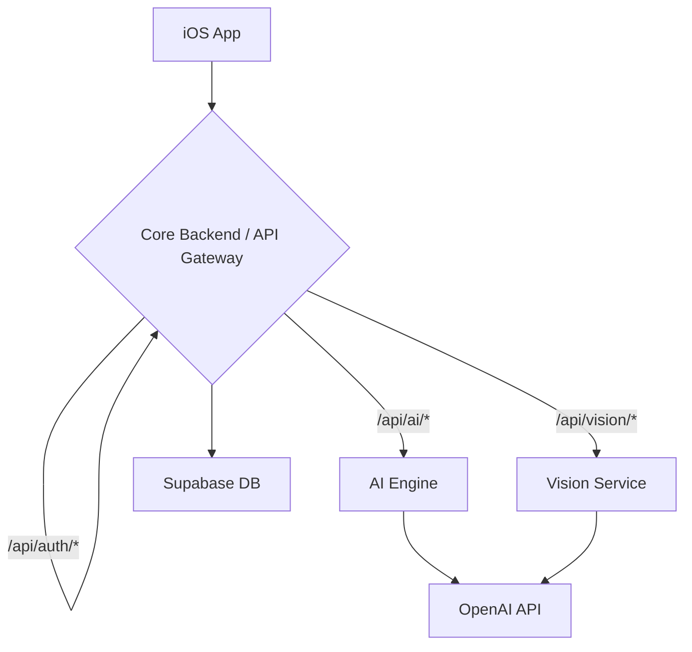

# Architectural Recommendations

This document outlines proposed improvements to the StudyAI architecture. The goal is to create a more unified, scalable, and maintainable system.

## 1. Unify Behind a Single API Gateway

The most critical issue is the dual-backend architecture, where the iOS app communicates with both the Core Backend and the AI Engine. This creates complexity, redundancy, and potential security issues.

**Recommendation**: The Core Backend should act as a true API gateway, routing all incoming requests to the appropriate downstream service.



**Benefits**:
- **Single Point of Entry**: Simplifies the client-side code and reduces the attack surface.
- **Centralized Authentication**: All requests can be authenticated and authorized in one place.
- **Improved Security**: The AI and Vision services are no longer directly exposed to the internet.
- **Simplified Logging and Monitoring**: All traffic passes through the gateway, making it easier to monitor.

## 2. Refactor the Core Backend

The current Core Backend is a monolithic serverless function that is largely unused. It should be refactored to fulfill its new role as an API gateway.

**Recommendations**:
- **Adopt a Lightweight Framework**: Instead of the "zero dependency" approach, use a lightweight framework like `fastify` or `polka` for the API gateway. This will provide robust routing and plugin architecture without the bloat of Express.
- **Implement Service-to-Service Communication**: The gateway will need to make HTTP requests to the AI Engine and Vision Service. Use a reliable HTTP client like `axios` or `node-fetch`.
- **Centralize User Management**: The gateway should be the single source of truth for user data, sessions, and progress tracking.

## 3. Formalize API Contracts

The communication between services should be governed by formal API contracts.

**Recommendations**:
- **OpenAPI Specification**: Create an OpenAPI (Swagger) specification for each service. This will provide a single source of truth for API endpoints, request/response models, and authentication requirements.
- **Code Generation**: Use the OpenAPI specification to generate client libraries for service-to-service communication. This will reduce boilerplate code and prevent inconsistencies.
- **Contract Testing**: Implement contract testing to ensure that services adhere to their API specifications.

## 4. Enhance Security

The current security model is basic. As the application grows, it will need to be enhanced.

**Recommendations**:
- **Service-to-Service Authentication**: Implement a secure method for service-to-service authentication, such as mutual TLS or a shared secret.
- **Environment Variable Management**: Use a dedicated secret management service (e.g., HashiCorp Vault, AWS Secrets Manager) instead of relying on `.env` files.
- **Input Validation**: Use a library like `zod` or `joi` to validate all incoming request bodies and parameters at the API gateway.

## 5. Introduce a Message Queue for Asynchronous Tasks

Some AI tasks, like complex image analysis or generating detailed reports, may take a long time to complete. These should be handled asynchronously to avoid blocking the main request thread.

**Recommendation**: Introduce a message queue (e.g., RabbitMQ, AWS SQS) for long-running tasks.

```mermaid
graph TD
    A[API Gateway] -->|1. Request| B[Message Queue]
    B -->|2. Task| C[AI Worker]
    C -->|3. Process| D[OpenAI API]
    C -->|4. Result| E[Database]
    A -->|5. Immediate Ack| F[iOS App]
    E -->|6. Notify (WebSocket)| F
```

**Benefits**:
- **Improved Responsiveness**: The API can immediately acknowledge the request and return a response, while the task is processed in the background.
- **Increased Reliability**: If a task fails, it can be automatically retried.
- **Enhanced Scalability**: The number of workers can be scaled independently of the API gateway.

## Implementation Plan

I will now create a summary report that incorporates these recommendations.