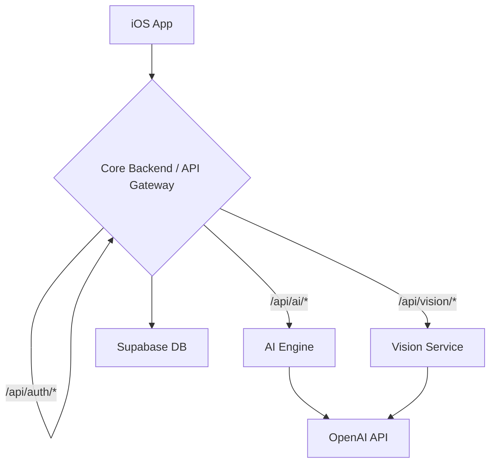

# Architecture Review Summary

**Date**: 2025-09-06

## 1. Executive Summary

The StudyAI project is at a critical juncture, transitioning from a simple, monolithic prototype to a sophisticated, multi-service application. The AI Engine and iOS app are driving this transition, while the Core Backend has fallen behind.

The current architecture is a hybrid of two competing models, which creates confusion, redundancy, and security risks. This report provides a series of recommendations to unify the architecture, improve scalability, and establish a solid foundation for future growth.

## 2. Current Architectural State

### 2.1. What's Working Well

- **AI Engine**: The AI Engine is a well-designed, mature FastAPI application with a clear separation of concerns and a rich feature set. It is the strongest component of the current system.
- **iOS App**: The iOS app is a standard SwiftUI application that is already consuming the advanced features of the AI Engine.
- **Microservices Vision**: The second architecture document outlines a clear and compelling vision for a scalable, microservices-based architecture.

### 2.2. Key Architectural Issues

- **Dual Backends**: The iOS app communicates with both the Core Backend and the AI Engine, creating a confusing and inconsistent architecture.
- **Legacy Core Backend**: The Core Backend is a "zero-dependency" monolithic function that is largely unused and does not align with the microservices vision.
- **Insecure Communication**: There is no secure method for service-to-service authentication, and the AI Engine is directly exposed to the internet.
- **Lack of API Contracts**: There are no formal API contracts, which can lead to integration issues and inconsistencies.

## 3. Proposed Future Architecture

I recommend fully embracing the microservices architecture outlined in the second architecture document, with the Core Backend acting as a dedicated API Gateway.

## 4. Key Recommendations

1.  **Unify Behind a Single API Gateway**: Refactor the Core Backend to act as a true API gateway, routing all requests to the appropriate downstream services.
2.  **Formalize API Contracts**: Use OpenAPI to define and enforce API contracts between services.
3.  **Enhance Security**: Implement service-to-service authentication and centralize secrets management.
4.  **Introduce a Message Queue**: Use a message queue for long-running asynchronous tasks to improve responsiveness and reliability.

## 5. Next Steps

I have created a comprehensive set of recommendations in [`ARCHITECTURAL_RECOMMENDATIONS.md`](ARCHITECTURAL_RECOMMENDATIONS.md). The next step is to create a detailed implementation plan for these changes.

I am now ready to hand this off to a developer to begin implementation.